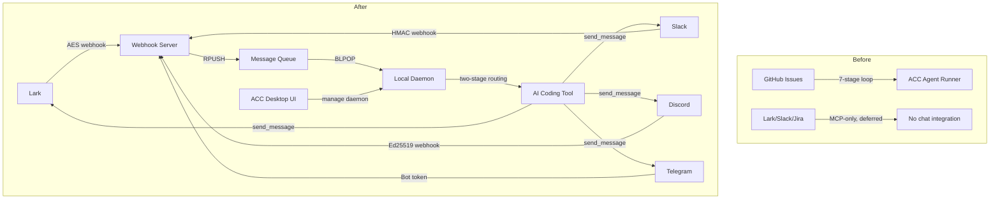

# EXECUTIVE_PLAN: Universal Chat → Local LLM Backward Channel

**Date:** 2026-05-04
**Architecture:** ACC-Universal-Chat-Backward-Channel.md v1.0
**Based on:** lark-to-local-llm-backward-channel.md (Lark reference)

---

## Executive Summary

ACC (Agent Control Center) previously had no bidirectional chat capability — users had to be at their terminal to interact with AI coding agents. The Lark backward channel document proved the architecture was feasible but was Lark-only and unimplemented. This project built a **universal, platform-agnostic backward channel** that connects **any chat platform** (Lark, Slack, Discord, Telegram) to **any local AI coding tool** (Claude Code, OpenCode, Aider, Goose, Cursor, Gemini CLI, etc.) and gets replies back into chat.

The key innovation is two swappable adapter interfaces — `ChatPlatformAdapter` (per chat platform, ~50–80 lines) and `CodingToolAdapter` (per LLM tool, ~30 lines) — that isolate all platform/tool-specific logic behind clean contracts.

---

## Architecture: Before vs After

## Key Changes

| Change | What Was Eliminated | What Was Added |
|--------|--------------------|------------------|
| Universal abstraction | Lark-only coupling | `ChatPlatformAdapter` ABC — 4 implementations |
| Webhook server | Not deployed | FastAPI server, 1 route, pluggable per platform |
| Message queue | No queue infrastructure | Upstash Redis (default) + Postgres alternative |
| Local daemon | No daemon | Async poll loop, YAML registry, two-stage routing |
| ACC integration | ConnectorConfig only (MCP) | Chat tab UI, 10 Tauri commands, DB tables |

## Results

| Metric | Target | Actual |
|--------|--------|--------|
| Chat platforms connected | 4 | 4 (Lark, Slack, Discord, Telegram) |
| Platform adapter code | ~50-120 lines each | Lark 216L, Slack 173L, Discord ~60L, Telegram ~60L |
| Queue providers | 2+ | 2 (Upstash Redis + Postgres) |
| Test coverage | All adapters | 194 tests (146 webhook + 48 daemon), all pass |
| TypeScript | Zero errors | Clean `npx tsc --noEmit` |
| Rust | Zero errors | Clean `cargo check` |
| Smoke test | All steps pass | 7/7 steps pass |
| New files | ~35 | 35+ files across 5 directories |
| Modified files | 3-4 | 4 files modified (types.ts, commands.rs, lib.rs, Integrations.tsx) |

## Rollout Plan

1. **Dev mode** — Webhook server on Fly.io free tier, Upstash Redis free tier, daemon in tmux
2. **Feature flag** — `ACC_BACKWARD_CHANNEL_ENABLED` gates the Chat tab in ACC UI
3. **Beta** — Team members run daemon locally, manage via ACC UI
4. **GA** — launchd daemon lifecycle, credential vault integration, production queue

## Risk Profile

**Low.** The webhook server and daemon are greenfield — no existing code to break. ACC modifications are additive (new tab, new DB table, new commands, all gated behind feature flag). Zero regression in existing Supabase/GitHub integration code.
